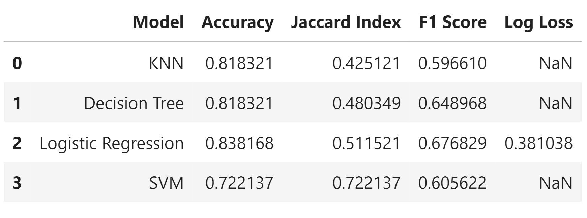

# Rain Prediction in Australia with Machine Learning and Classification Models

## Overview
This project demonstrates the application of various machine learning classification models on a dataset to predict categorical outcomes. The primary goal is to compare the performance of different models and identify the best approach for classification tasks.

## Data Set

The original source of the data is the Australian Government's Bureau of Meteorology and the latest data can be gathered from [http://www.bom.gov.au/climate/dwo/]. This dataset contains observations of weather metrics for each day from 2008 to 2017. 

The dataset to be used has extra columns like 'RainToday' and our target is 'RainTomorrow', which was gathered from the Rattle at https://bitbucket.org/kayontoga/rattle/src/master/data/weatherAUS.RData

* Source: Weather Dataset on Kaggle
* Number of Instances: 3,271
* Number of Features: 66
* Target Variable: RainTomorrow (Binary: 1 = Rain, 0 = No Rain)
  
The dataset includes features such as temperature, humidity, wind speed, and atmospheric pressure, which are used to build and evaluate the models.

## Procedure

Data Splitting: The dataset was split into training (80%) and testing (20%) sets.
Model Training: Various classification models were trained using the training set.
Evaluation: Models were evaluated using accuracy, Jaccard Index, F1 Score, and Log Loss (for Logistic Regression).

## Models Used

* K-Nearest Neighbors (KNN)
* Decision Tree
* Logistic Regression
* Support Vector Machine (SVM)

## Conclusions

**Logistic Regression** achieved the highest accuracy (83.82%) and best F1 Score (67.68%) among the models, making it the most effective for this dataset.

**Decision Tree** performed well with an accuracy of 81.83% and an F1 Score of 64.90%, showing strong classification performance.

**K-Nearest Neighbors** and **Support Vector Machine** had lower performance compared to Logistic Regression and Decision Tree, with SVM showing lower overall accuracy (72.21%).

This analysis provides insights into the effectiveness of different classification models in predicting weather conditions and highlights Logistic Regression as the most reliable model for this task.
